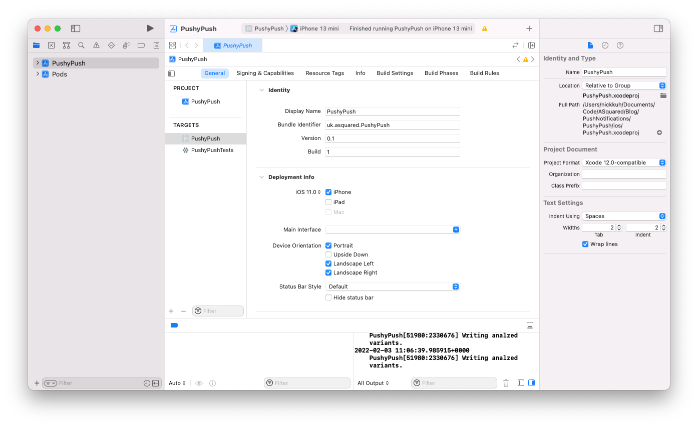
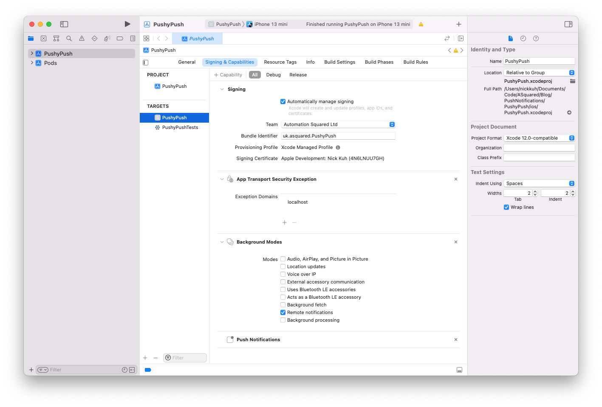
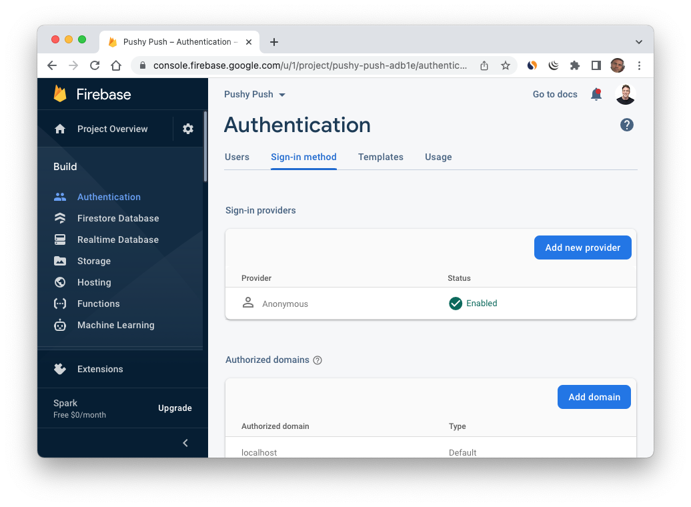
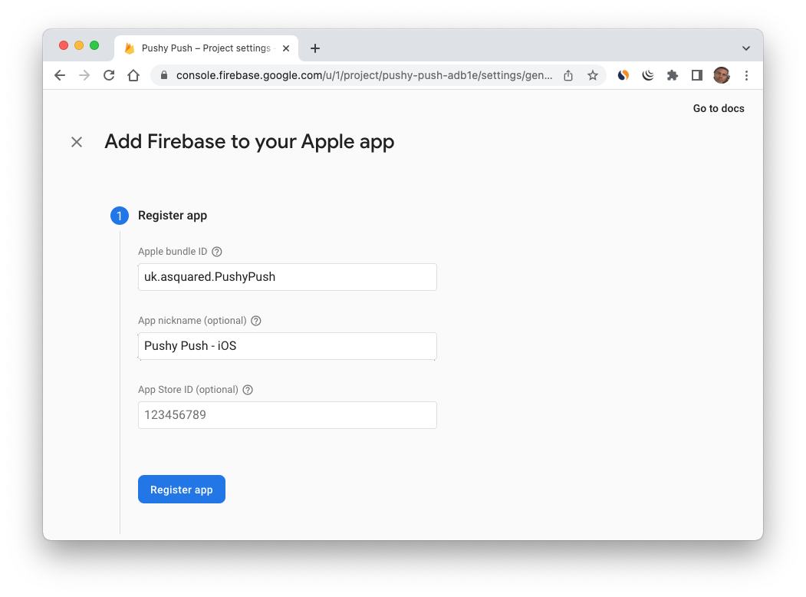
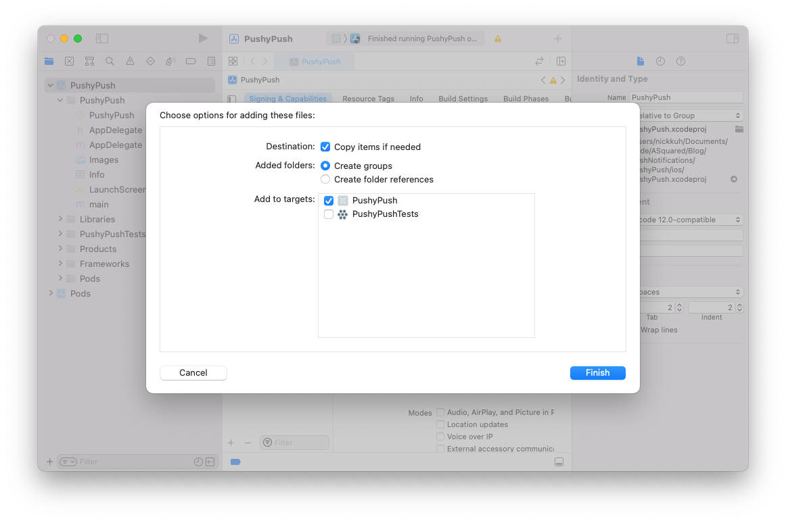
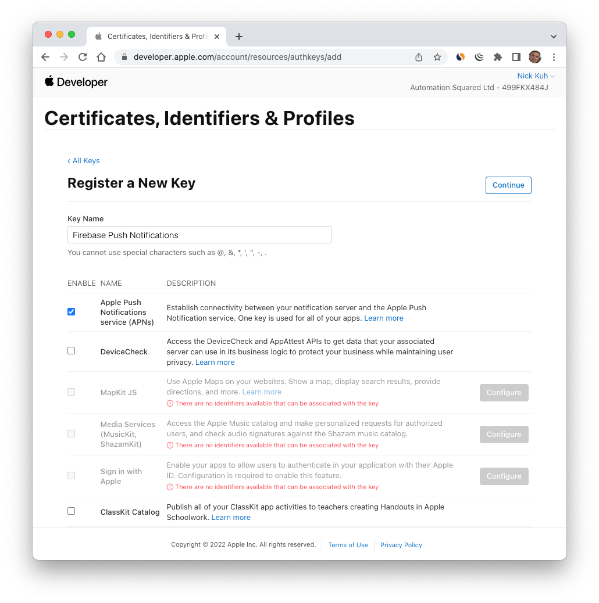
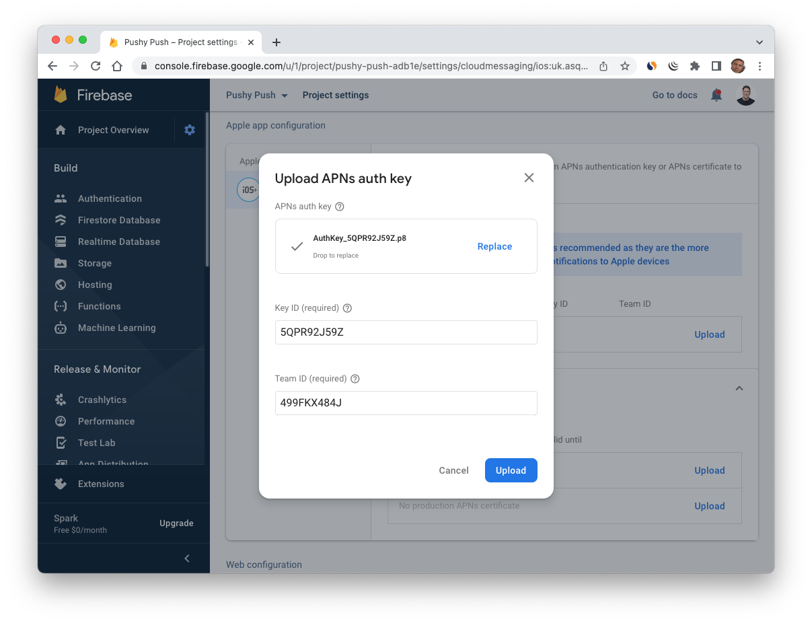
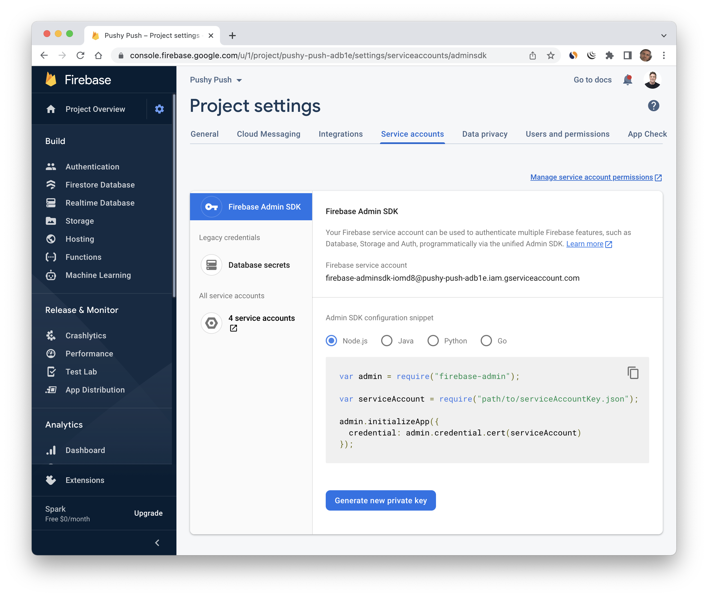

## How to Code Push Notifications for React Native Apps

Please step through the following tasks that they are listed below. After (or during) each task please commit to your feature branch:

### Step 1 - Create a new React Native project with TypeScript

[React Native TypeScript project setup](https://reactnative.dev/docs/typescript)

```
npx react-native init PushyPush --template react-native-template-typescript
```

### Step 2 - Enable Apple Push in Xcode

1. Setup a bundle identifier



2. Login to your Apple Developer Account via Xcode > Preferences > Accounts
3. Under Signing & Capabilities in Xcode select and connect the Xcode Project to your Apple Developer Team
4. Tap to add a new capability and select Background Modes
5. Select `Remote Notifications` from the options
6. Tap again to add another new capability and select Push Notifications. Your options should look similiar to the following:



### Step 4 - Add Firebase

Using [Firebase](https://firebase.google.com/) for easy targeting of push notifications to:

- groups of users or...
- individual users

1. Create a new Firebase project
2. Activate Authentication in Firebase
3. Enable Anonymous Sign-in option (if you're already using Firebase for your authenticate that's fine too, the aim is to have a unique user id to send push notifications too)



#### Setup your iOS Project in Firebase

1. Within the Firebase UI tap the settings cog of your project and choose `Project Settings`
2. Tap the iOS app from the different app options
3. Enter your iOS app's unique bundle identifier - make sure it matches the one you setup in Xcode.



4. As per the Firebase instructions download the `GoogleServices-Info.plist` file to your Mac and add it to the root of your Xcode project by dragging it into your project in Xcode. I reccommend selecting `Copy items if needed` when adding it:



5. Don't worry about adding the Firebase iOS SDK - that will get added in a later stage via [React Native Firebase](https://rnfirebase.io/)

### Step 5 - Create a APNs Authentication Key Push in the Apple Developer Center

1. Login to your Apple Developer Account and choose [Keys](https://developer.apple.com/account/resources/authkeys/list).
2. Tap the `+` button to add a new push key
3. Ensure the `Apple Push Notifications service (APNs)` option is selected and then hit `Continue`



4. Register your new key.
5. Download your new key. Don't close this window as it displays your key's id which you'll need in the next step.
6. Back in Firebase > Project Settings > Cloud Messaging upload your new key to your Apple project



You will need to enter both your key id and apple team id that you can copy and paste from the Apple Developer portal.

### Step 6 - Back to the App - Install React Native Firebase modules

1. Install the following 3 React Native Firebase modules:

```
npm install @react-native-firebase/app @react-native-firebase/messaging @react-native-firebase/messaging @react-native-firebase/auth
cd ios
pod install
```

2. Follow the [iOS Setup](https://rnfirebase.io/#3-ios-setup) instructions to ensure the native iOS Firebase SDK get's initialised by the AppDelegate

3. Install Push Notification iOS library

```
npm install @react-native-community/push-notification-ios
cd ios
pod install
```

3. Install React Native Community Hooks

```
npm install @react-native-community/hooks
cd ios
pod install
```

### Step 6 - User Permissions

### Step 7 - Subscribing to Topics

### Step 8 - Sending and Targetting Push Notifications

1. Create and download a Firebase admin service key for your project



2. Create a folder at the root of your project named `scripts` and within that add a `keys` folder. Move the downloaded key to that folder.

```
npm install --dev firebase-admin ts-node
```

Add a new script entry to your package.json:

"send-notification": "GOOGLE_APPLICATION_CREDENTIALS=./scripts/keys/`[name of your key].json` npx ts-node ./scripts/send-notification.ts"

And then add the following `send-notification.ts` file to your `scripts` folder:

```
import * as admin from 'firebase-admin';

export const sendNotification = async (props: {
  topic: string;
  payload: admin.messaging.MessagingPayload;
}) => {
  const {topic, payload} = props;
  try {
    admin.initializeApp();
    await admin.messaging().sendToTopic(topic, payload, {priority: 'high'});
    return 'Sent';
  } catch (err) {
    // tslint:disable-next-line: no-console
    console.log('err', err);
    throw err;
  }
};

sendNotification({
  topic: 'all',
  payload: {
    notification: {
      title: 'Hello There Nick!',
      body: 'Whassup bud!',
      sound: 'default',
    },
    data: {
      deeplink: 'home',
    },
  },
})
  .then(res => {
    console.log(res);
    process.exit();
  })
  .catch(err => {
    console.log('Failed to send push', err);
    process.exit();
  });

```

Try it out:

```
npm run send-notification
```

### Step 9 - Receiving Push Notifications

1. Checkout the docs [here](https://rnfirebase.io/messaging/usage#receiving-messages)
